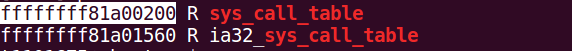
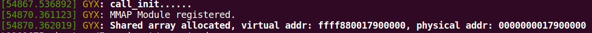
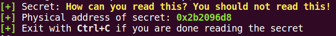
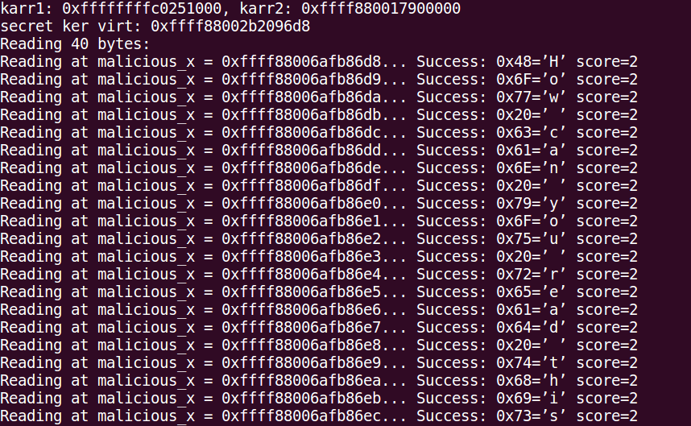

## Secret Spectre

这个作业真的让人一言难尽，所以把它开源出来，不感兴趣的朋友就不要浪费时间了...

### 如何运行

#### 第一步

```bash
sudo cat /boot/System.map-`uname -r` | grep sys_call_table
```



获得系统调用表的地址，`SystemCall.c`的`SYS_CALL_TABLE_ADDRESS`改成这个地址。

#### 第二步

```bash
cd Secret-Spectre
make
sudo dmesg -C
sudo insmod SystemCall.ko
sudo insmod mmap_test_kernel.ko
dmesg
```

这时会看到类似这样的东西：



#### 第三步

然后再开一个终端，运行meltdown里面的那个./secret （这里没有放）得到



#### 第四步

回到`Secret-Spectre`目录运行

```bash
sudo ./Spectre ffff880017900000 2b2096d8
```

第一个参数是第二张图里面的virtual addr，第二个参数是第三张图里面的0x2b2096d8。




注：

1. 我的Ubuntu为16.04（就是助教发的那个链接），Linux内核版本为4.4.0，原来更高版本的内核加不了系统调用，还手动降了版本。
2. 即便这样换一台机器也不一定能运行...
3. Linux内核降了版本之后可能会出现找不到build目录的问题，可以参考 https://askubuntu.com/questions/554624/how-to-resolve-the-lib-modules-3-13-0-27-generic-build-no-such-file-or-direct 下一个开发包。
4. 有什么问题欢迎指出！
